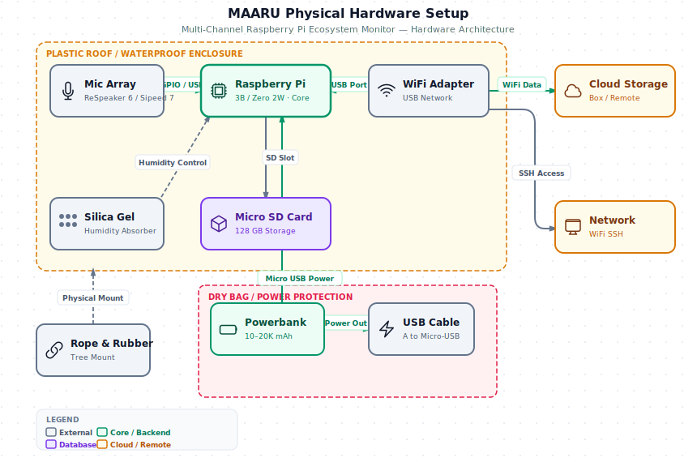
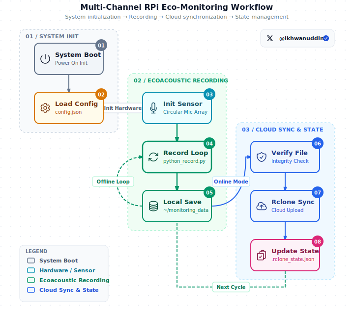

# System Architecture & Workflow

Overview of how the multi-channel ecosystem monitoring system works.

## Physical Hardware Setup

MAARU (Multi-Channel Acoustic Recording Unit) is a rugged ecosystem monitoring system built for tropical rainforest environments. The diagram below shows the physical hardware layout, weatherproofing layers, and how components connect to each other.



> **Tip**: The diagram scales with the page width. For an interactive version with theme toggle and export options, open [maaru-physical-setup.html](../../maaru-physical-setup.html).

### Nested Architecture Layers

#### **Layer 1: Waterproof Roof**
- **Function**: Protects against direct rainfall over the main enclosure
- **Material**: Recycled plastic container
- **Protection**: Water runoff to sides, extends enclosure lifespan

#### **Layer 2: Main Enclosure (Food Container)**
Core components protected from direct weather:

- **Raspberry Pi 2B or Zero 2W**
  - Compute core for the system
  - Pi 2B: Recommended (more stable, better performance)
  - Pi Zero 2W: Minimum (lower power, cheaper)

- **Microphone Array Sensor** (choose one)
  - **ReSpeaker 6-Mic Array** → connected via **GPIO pins**
    - 6 channel simultaneous recording
    - Lower power consumption (~0.5A)
    - Direct I2S connection
  - **Sipeed 7-Mic Array** → connected via **USB port**
    - 7 channel simultaneous recording
    - Self-powered via USB
    - Better for modularity

- **Micro SD Card**
  - Local storage for audio files (.FLAC)
  - Typical: Class 10, 200+ MB/s speed
  - Capacity: 64GB-256GB (depends on retention policy)

- **USB WiFi Adapter**
  - Wireless network connectivity
  - For SSH access from mobile/computer
  - For cloud storage upload (optional)
  - Powered from Pi USB port

- **Silica Gel**
  - Absorbs ambient moisture in tropical rainforest environment
  - Essential for preventing condensation inside enclosure
  - Replace every 1-2 weeks or when saturated

- **IP68 Acoustic Membrane**
  - Specialized layer at microphone holes
  - Water-resistant (IP68 rated)
  - Maintains acoustic transparency

- **Silicon Sealant**
  - Seals all cable holes
  - Prevents water ingress

#### **Layer 3: Dry Bag (Power Protection)**
- **Function**: Protects powerbank from moisture and water damage
- **Location**: Outside main enclosure, within plastic roof
- **Contents**: Powerbank supplying power to Pi
- **Connection**: USB Cable (USB-A to Micro-USB) to Pi power port

### Physical Connections & Power Flow

| Component | Connected to | Interface | Power (A) | Notes |
|-----------|-------------|-----------|----------|-------|
| **Mic Sensor** | Raspberry Pi | GPIO (ReSpeaker) or USB (Sipeed) | 0.3-0.8 | Choose one |
| **USB WiFi** | Raspberry Pi | USB Port | 0.2-0.5 | Optional, for network |
| **Micro SD** | Raspberry Pi | SD Card Slot | 0.1 | Local storage |
| **Powerbank** | Raspberry Pi | Micro USB Power | Vout=5V | Primary power supply |
| **Silica Gel** | Environment | Humidity control | N/A | Passive, absorbs moisture |

### Mounting & Environmental Protection

- **Rope & Rubber**: Tethered to tree for stability and fall prevention
- **Food Container + Plastic Roof**: Protection from extreme weather (rain, UV, insects)
- **Silica Gel**: Humidity control in tropical rainforest environment
- **IP68 Membrane**: Protects acoustic holes from water ingress

### External & Cloud

- **Cloud Storage (Box)**: Destination for audio files uploaded via rclone
- **Network Access**: SSH via USB WiFi adapter (if connected)

---

## System Components (Software)

This section describes the software components running on MAARU:

```
┌─────────────────────────────────────────────────────────────┐
│                    Raspberry Pi                              │
├─────────────────────────────────────────────────────────────┤
│                                                               │
│  ┌──────────────┐      ┌──────────────┐   ┌──────────────┐  │
│  │   Sensor     │      │   Python     │   │   Rclone     │  │
│  │  (7-Mic      │──→   │   Recorder   │──→│   Upload     │  │
│  │   Array)     │      │              │   │              │  │
│  └──────────────┘      └──────────────┘   └──────────────┘  │
│        │                      │                    │          │
│        USB/GPIO               │               Network         │
│                         Local Storage            (optional)   │
│                         .FLAC files                           │
│                                                               │
│  ┌──────────────┐      ┌──────────────┐   ┌──────────────┐  │
│  │  Config      │      │   Startup    │   │   Logs       │  │
│  │  JSON        │──→   │   Script     │──→│              │  │
│  │              │      │              │   │              │  │
│  └──────────────┘      └──────────────┘   └──────────────┘  │
│                                                               │
└─────────────────────────────────────────────────────────────┘
         │
         ├─→ Local Files: ~/monitoring_data/
         ├─→ Config: ~/multi-channel-rpi-eco-monitoring/config.json
         └─→ Logs: ~/logs/
```

---

## Boot Sequence

When the Raspberry Pi starts:

1. **System Boot** (~1-2 seconds)
   - Kernel loads, file systems mount
   - Systemd starts core services

2. **Auto-Login** (~5 seconds)
   - If configured: auto-login as `pi` user
   - `/etc/profile` executed

3. **Startup Script** (`recorder_startup_script.sh`)
   - Loads config.json
   - Initializes audio sensor
   - Enters recording loop or upload loop (depending on mode)

**Timeline**: System ready to record within 10-15 seconds of power-on.

---

## Recording Workflow

### Workflow Overview



### Offline Mode (Default)

```
┌──────────────┐
│ Boot System  │
└──────┬───────┘
       │
       ↓
┌──────────────────────┐
│ Load config.json     │
│ Initialize sensor    │
└──────┬───────────────┘
       │
       ↓
┌──────────────────────┐
│ Start Recording      │
│ Duration: 20 min     │
│ Channels: 7          │
│ Sample Rate: 16 kHz  │
└──────┬───────────────┘
       │
       ↓
┌──────────────────────┐
│ Audio Saved          │
│ File: file_XXX.flac  │
│ Size: ~300 MB        │
└──────┬───────────────┘
       │
       ↓
┌──────────────────────┐
│ Wait (if needed)     │
│ Resume Loop          │
└──────┬───────────────┘
       │
       └─→ Repeat
```

### Online Mode (With Cloud Upload)

```
┌──────────────┐
│ Record Audio │
│ 20 minutes   │
└──────┬───────┘
       │
       ↓
┌──────────────────────┐
│ Verify File          │
│ Check integrity      │
└──────┬───────────────┘
       │
       ↓
┌──────────────────────┐
│ Upload to Cloud      │
│ Using rclone         │
└──────┬───────────────┘
       │
       ↓
┌──────────────────────┐
│ Upload Success?      │
├──────┬───────────────┤
│ YES  │     NO        │
│      │               │
│ Delete  Keep local  │
│ local   Retry next  │
│         cycle       │
└──────┴───────────────┘
```

---

## Core Scripts

### 1. `recorder_startup_script.sh`

**Purpose**: Main entry point, runs at boot

**Flow**:
1. Reads config.json to determine mode (offline/online)
2. Calls `python_record.py` in a loop
3. Handles errors and retries
4. Manages shutdown signals

**Logs to**: `~/logs/startup.log`

---

### 2. `python_record.py`

**Purpose**: Performs the actual audio recording

**Key Functions**:
- Initialize audio device
- Read from microphone buffer
- Save to FLAC file
- Monitor disk space
- Handle Ctrl+C gracefully

**Key Classes**:
- `MinuteBoundaryFormatter`: Prefix logs with timestamp only when minute changes
- Sensor classes: `Sipeed7Mic`, `Respeaker6Mic`, `Respeaker4Mic`

**Logs to**: `~/logs/monitor.log`

---

### 3. `rclone_upload.sh`

**Purpose**: Uploads recorded files to cloud storage

**Flow**:
1. Read `.rclone_state.json` (tracks what's uploaded)
2. For each new file:
   - Verify file integrity
   - Upload using rclone
   - Track in state file
   - Delete local copy (if configured)
3. Handle upload failures gracefully

**Called by**: `recorder_startup_script.sh` (in online mode)

**Logs to**: `~/logs/upload.log`

---

### 4. `setup_config.py`

**Purpose**: Interactive configuration wizard

**Flow**:
1. Ask user for sensor type
2. Ask for recording parameters
3. Ask for cloud settings (if online mode)
4. Validate inputs
5. Save to config.json

**Output**: `config.json`

---

## Data Flow

### File Naming Convention

```
~/monitoring_data/
├── 20240701_142300.flac    # YYYYMMDD_HHMMSS
├── 20240701_143000.flac
├── 20240701_143700.flac
└── ...
```

Filename format makes chronological ordering trivial.

### File Size Factors

| Factor | Typical Value | Impact |
|--------|---------------|--------|
| Channels | 7 | Fixed per sensor |
| Sample Rate | 16,000 Hz | Higher = larger files |
| Bit Depth | 16 bits | Higher = larger files |
| Duration | 1,200 sec (20 min) | Longer = larger files |
| Codec | FLAC | 40-60% compression |

**Rough formula**:
```
Size = (sample_rate × channels × bit_depth / 8) × duration × (1 - compression%)
     = (16,000 × 7 × 2) × 1,200 × 0.5
     ≈ 268 MB per 20-minute session
```

---

## Configuration Cascade

When the system starts, it reads settings in this order:

1. **Default values** (hardcoded in scripts)
2. **config.json** (user configuration)
3. **Command-line arguments** (if running manually)
4. **Environment variables** (if set)

Each level overrides the previous one.

---

## Sensor Integration

### Adding a New Sensor

To support a new microphone array:

1. Create new class in `sensors/NewSensor.py`:
   ```python
   class NewSensor(SensorBase):
       def __init__(self, device_index, channels, sample_rate, bit_depth):
           # Initialize hardware
       
       def record_chunk(self, duration):
           # Capture and return audio data
   ```

2. Register in `sensors/__init__.py`:
   ```python
   from NewSensor import NewSensor
   ```

3. Add to `setup_config.py` valid sensor options

4. Test with:
   ```bash
   python python_record.py --sensor newsensor
   ```

---

## Error Handling Strategy

### Recording Errors

| Error | Cause | Recovery |
|-------|-------|----------|
| OVERRUN | Audio buffer full, samples lost | Retry next cycle, or upgrade SD card |
| Device not found | Sensor disconnected | Wait for reconnect, retry |
| Disk full | No space left | Delete old files, expand storage |

**Strategy**: Log error, wait, retry (graceful degradation)

### Upload Errors

| Error | Cause | Recovery |
|-------|-------|----------|
| Connection timeout | Network down | Keep local file, retry next cycle |
| Auth failed | Credentials expired | Re-authenticate, continue |
| Disk error | SD card failure | Manual intervention needed |

**Strategy**: Persist failed files, retry on next cycle with exponential backoff

---

## Performance Characteristics

### CPU Usage

- **Idle**: ~5% (waiting for next recording)
- **Recording**: ~30-50% (audio capture + encoding)
- **Upload**: ~10-20% (file I/O)

On Raspberry Pi Zero 2 W, these are acceptable.

### Memory Usage

- **Baseline**: ~100 MB (Python + libraries)
- **Peak Recording**: ~200-300 MB (audio buffer + encoding)

Sufficient for Pi Zero 2 W (512 MB) and larger models.

### Network Bandwidth

**Upload speed** (typical):
- 300 MB file over 1 Mbps connection ≈ 40 minutes
- Same file over 10 Mbps connection ≈ 4 minutes

**Optimize**:
- Schedule uploads during off-peak hours
- Use faster internet (wired > WiFi)
- Compress with FLAC codec

---

## Logging Architecture

All components write to logs with **structured prefixes**:

```
[timestamp] [component][mode=X][phase=Y][details] message
```

This enables:
- **Easy filtering**: `grep "\[phase=error\]"`
- **Component isolation**: `grep "\[upload\]"`
- **Timeline reconstruction**: `grep "202407011423"`

See [log_guide.md](log_guide.md) for details.

---

## State Persistence

### Configuration State
- **File**: `config.json`
- **Scope**: Recording parameters, upload settings
- **Persistence**: Survives reboots
- **Frequency**: Loaded once at startup

### Upload State
- **File**: `.rclone_state.json`
- **Scope**: Which files have been uploaded
- **Persistence**: Survives reboots
- **Frequency**: Updated after each upload attempt

### Boot State
- **Location**: Kernel arguments, systemd services
- **Scope**: Auto-login, GPIO buttons, network
- **Persistence**: Survives reboots
- **Frequency**: Applied at boot

---

## Shutdown Procedure

### Graceful Shutdown

1. **User action**: Press button or run `sudo halt`
2. **Signal received**: SIGTERM/SIGINT propagates
3. **Recording stopped**: Current audio buffer flushed
4. **Uploads paused**: In-progress uploads terminated
5. **Logs finalized**: Last messages written
6. **System halts**: Kernel cleanly unmounts filesystems

### Emergency Shutdown

If power loses unexpectedly:
1. Files in recording buffer may be incomplete
2. Uploads may be partial
3. State tracking continues on next boot
4. `.rclone_state.json` prevents re-uploading

---

## Deployment Models

### Single Device Offline

```
Pi → SD Card (Local Storage)
```

Best for: Site characterization, temporary surveys

### Single Device Online

```
Pi → SD Card → Rclone → Cloud Storage (Box/Drive)
```

Best for: Long-term monitoring, remote sites with internet

### Multi-Device Parallel

```
Pi #1 ──┐
Pi #2 ──→ Shared Cloud Folder
Pi #3 ──┘
```

Best for: Ecosystem-wide monitoring, multiple locations

---

## System Requirements

### Minimum

- **Raspberry Pi**: Zero 2 W (1 GHz, 512 MB RAM)
- **Storage**: Class 10 SD card, 150 MB/s minimum
- **Power**: 5V 2A supply

### Recommended

- **Raspberry Pi**: 3B+, 4B+ (better stability, faster uploads)
- **Storage**: UHS-I SD card, 200+ MB/s
- **Power**: 5V 2.5A+ with UPS (optional)
- **Network**: Wired Ethernet or strong WiFi for uploads

---

## Monitoring Health

Check system regularly:

```bash
# Is recording happening?
ls -lt ~/monitoring_data/ | head -1

# Recent errors?
grep "\[phase=error\]" ~/logs/*.log | tail -5

# Disk usage?
df -h

# CPU/memory?
top -b -n 1
```

See [troubleshooting.md](troubleshooting.md) for diagnostic scripts.

---

## See Also

- [readme.md](readme.md) - Setup instructions
- [physical-setup.md](physical-setup.md) - **Hardware components & protection details** (start here for "orang umum")
- [config.md](config.md) - Configuration options
- [log_guide.md](log_guide.md) - Log format reference
- [troubleshooting.md](troubleshooting.md) - Common issues
- [MAARU Physical Setup Diagram](../../maaru-physical-setup.html) - Interactive SVG visualization
